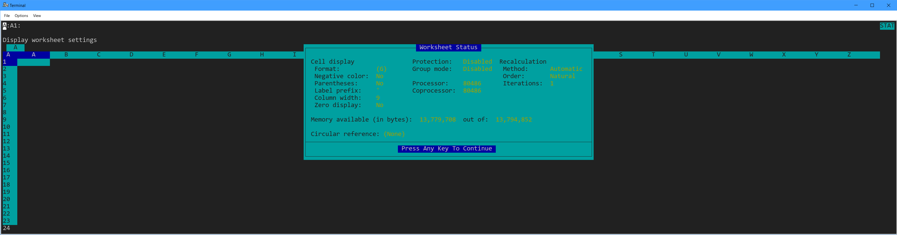

# Lotus 1-2-3 R4D Display Driver for DOSEMU2

This is a <abbr title="Work in Progress">WIP</abbr> display driver for
Lotus 1-2-3 R4D to enable support for arbitrary text resolutions in
[DOSEMU2](https://github.com/dosemu2/dosemu2).

That means you can run 123 in a maximized xterm, and see more columns than
you could possibly want!



> Note: This driver is intended for DOSEMU2 in *-term* mode, i.e. running in a terminal.

I used MSVC 8.00c (still available to MSDN subscribers), I believe it's the
last version of MSVC that could target DOS.

In case you're wondering, DJGPP (the GCC port to DOS) can only produce 32-bit
[DPMI](https://en.wikipedia.org/wiki/DOS_Protected_Mode_Interface) code, but
123 is a true 16-bit real mode application. It *might* be possible to switch in
and out of dpmi mode with a small stub, but 123 uses a lot of memory management
tricks and frankly intermixing the two seems really hard. I think it's a better
solution to stay in real mode.

This driver basically works, but I haven't fully implemented all the API, so if you
do something unusual it might trap. It might take a few more weekends to be totally
stable! At the moment, it also has some debugging code that logs all the calls,
I'll remove that when it's ready for other people to use.

I highly doubt anybody else will want to use this, but if you are excited
to help hacking on this, or writing modern add-ins for 1-2-3, I'd love to hear
about it!

Future ideas:

- A FILE driver that adds native support for XLS, or ODT?
- libcaca support so that text mode graphs work?
- More modern @functions?
- Javascript/Python/lua bindings? (there was an official REXX module in the 90s, so this doesn't seem farfetched!)

I have some development notes available
[here](https://lock.cmpxchg8b.com/lotus123.html).

# Building

> If you just want a binary to try, check out the Releases section.

Note that this code isn't really ready for non-developer use yet, but you're
welcome to try it out and tell me about any visual glitches or crashes!

I wrote the code on Linux, and then used dosemu to run the old toolchain.

For example, you can run tasm from a Makefile like `dosemu -dumb -E "tasm ..."`

The `-dumb` (i.e. dumb terminal) option makes old DOS tools work like UNIX
tools. This requires you have your autoexec.bat setup so that `%PATH%` works,
but is very convenient for development - even exit codes work!

# FAQ

**Q. Which display driver should I be using for terminal mode?**

A. The CGA driver works, but this driver is better :-)

**Q. If I use the /Worksheet/Status command, 123 does not see all the EMS/XMS memory I have configured in DOSEMU?**

A. Try adding `SET 123MEMSIZE=134217728` (that's 128M, use an appropriate number for your configuration) to `fdppauto.bat`.

There is also `123SWAPPATH`, `123VIRTSIZE` and `123SWAPSIZE` if you want to tweak it.

**Q. If I try to use 123 in two xterms simultaneously, I get an error like "The stand-alone license is not currently available".**

A. Add something like this to your `fdppauto.bat`

```bat
REM CLEAN UP LICENSE FOR 1-2-3
DEL C:\123R4D\LICENSE.000 > NUL
COPY NUL C:\123R4D\LICENSE.000 > NUL
```

**Q. What DOSEMU settings do you use for 123?**

A. Here is my [dosemurc](https://lock.cmpxchg8b.com/files/dosemurc)

**Q. How can I send 123 worksheets to someone else?**

A. Libreoffice can open and convert WK3 files, if necessary. Most formulas and features will be preserved.


**Q. Can I fetch external data into 123, like stock prices with a macro?**

A. I use a macro like this to fetch stock prices (simplified):

```
{SYSTEM "UNIX stocks.sh GOOGL > %TEMP%\STOCKS.TXT"}
{OPEN "C:\TMP\STOCKS.TXT", "r"}
{READLN C1}
{CLOSE}
```

The `UNIX` command is a `DOSEMU` feature, it runs a command on the host. The online help explains how to loop over ranges, etc.

**Q. What do I need to know to get started?**

A. If you don't have a manuel, there's one available online [here](https://archive.org/details/lotus-1-2-3-release-3.1-reference/).

Assuming you've used a spreadsheet before, you should be able to get started quickly.

| Key | Description |
| --- | ------------|
|  /  | Open the 123 menu.
| F4  | Enter point mode, to select ranges.
| Ctrl PgUp/PgDn | Move between open tabs/sheets.
| F1  | Open online help.

If you want to be able to open your documents to your `~/Documents` directory, you can add something like
`LREDIR D: \\linux\fs\home\foo\Documents` to your `fdppauto.bat`.
