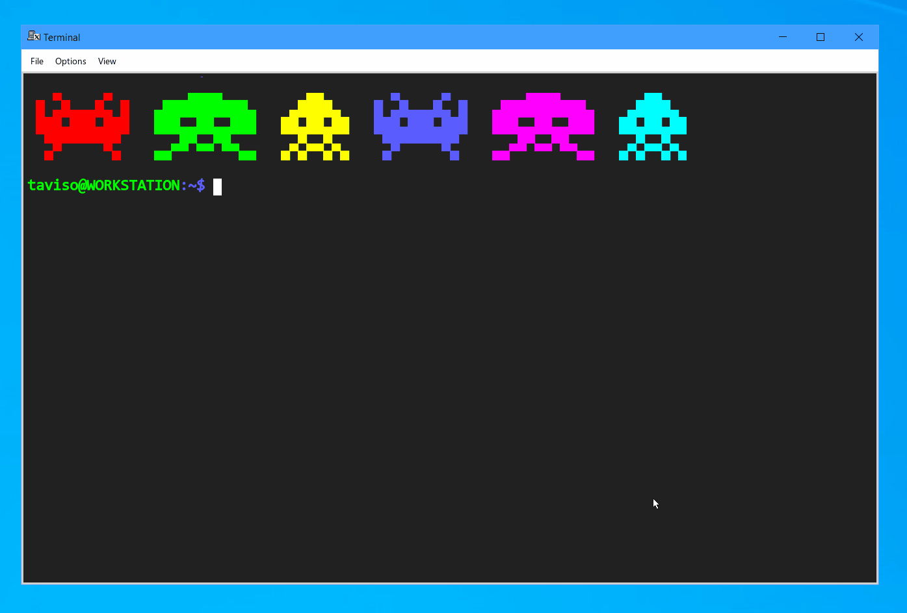

# Lotus 1-2-3 R4D Display Driver for DOSEMU2

This is a work-in-progress display driver for Lotus 1-2-3 R4D to enable support
for arbitrary text resolutions in [DOSEMU2](https://github.com/dosemu2/dosemu2).

That means you can run 123 in a maximized xterm, and see more columns than
you could possibly need!


> Note: This driver is intended for DOSEMU2 in *term* mode, i.e. running in a terminal.

This driver basically works, but I haven't fully implemented all the API, so if you
do something unusual it might trap.

If you are excited to help hacking on this, or writing modern add-ins for
1-2-3, I'd love to hear about it!

Future ideas:

- A FILE driver that adds native support for XLS, or ODT?
- ~~libcaca support so that text mode graphs work?~~ working on it!
- More modern @functions?
- Javascript/Python/lua bindings?

# Graphs

I have an incomplete ascii-art graphics implementation. That means drawing
simple graphs will work even in a terminal! Don't expect high resolution
graphics, but simple line, bar, and even pie charts really do work!

Here is a screenshot of a sine wave line graph, it will improve in future.



I have some development notes available
[here](https://lock.cmpxchg8b.com/lotus123.html).

# Building

> If you just want a binary to try, check out the Releases section.

Note that this code isn't really ready for non-developer use yet, but you're
welcome to try it out and tell me about any visual glitches or crashes!

# 123 FAQ

**Q. Which display driver should I be using for terminal mode?**

A. Select the CGA driver during install, then install this driver :-)

**Q. If I use the /Worksheet/Status command, 123 does not see all the EMS/XMS memory I have configured in DOSEMU?**

A. Try adding `SET 123MEMSIZE=134217728` (that's 128M, use an appropriate number for your configuration) to `fdppauto.bat`.

There is also `123SWAPPATH`, `123VIRTSIZE` and `123SWAPSIZE` if you want to tweak it.

**Q. If I try to use 123 in two xterms simultaneously, I get an error like "The stand-alone license is not currently available".**

A. Add something like this to your `fdppauto.bat`

```bat
REM CLEAN UP LICENSE FOR 1-2-3
DEL C:\123R4D\LICENSE.000 > NUL
COPY NUL C:\123R4D\LICENSE.000 > NUL
```

**Q. What DOSEMU settings do you use for 123?**

A. Here is my [dosemurc](https://lock.cmpxchg8b.com/files/dosemurc)

**Q. How can I send 123 worksheets to someone else?**

A. LibreOffice can open and convert WK3 files, if necessary. Most formulas and features will be preserved.

**Q. Can I fetch external data into 123, like stock prices with a macro?**

A. I use a macro like this to fetch stock prices (simplified):

```
{SYSTEM "UNIX stocks.sh GOOGL > %TEMP%\STOCKS.TXT"}
{OPEN "C:\TMP\STOCKS.TXT", "r"}
{READLN C1}
{CLOSE}
```

The `UNIX` command is a `DOSEMU` feature, it runs a command on the host. The
123 online help explains how to loop over ranges, etc.

I have a very simple demo sheet that demonstrates how to do this available
[here](https://lock.cmpxchg8b.com/files/findemo.wk3).

It demonstrates how to automatically populate a table of stock prices, press
`Alt-R` to update stock prices. Use `Ctrl-PgUp` and `Ctrl-PgDn` to switch
sheets and browse around.

You will need a script in your `$PATH` like this, and don't forget to add it to
your `$_unix_exec`.

```bash
#!/bin/bash

declare api="https://query1.finance.yahoo.com/v7/finance/quote"
declare filter=".quoteResponse.result[].regularMarketPrice"

curl -s "${api}?symbols=${1:-^GSPC}" | jq -r "${filter}" | cat
```

**Q. What do I need to know to get started?**

A. If you don't have a manual, there's one available online [here](https://archive.org/details/lotus-1-2-3-release-3.1-reference/Lotus%201-2-3%20Release%203.1%20-%20Tutorial).

If you've used any spreadsheet before, you should be able to get started
quickly. Functions use `@` instead of `=`, but the common functions like
`@SUM`, `@AVG`, `@INDEX`, and even `@HLOOKUP` all work as you would expect.

| Key | Description |
| --- | ------------|
|  /  | Open the 123 menu.
| F1  | Open online help.
| F2  | Edit an existing cell contents, just type to overwrite cell.
| F3  | Show names, press F3 while editing to see a list of functions or ranges.
| F4  | Enter point mode - it's like visual mode in Vim - to select ranges.
| F5  | Goto Address.
| Ctrl PgUp/PgDn | Move between open tabs/sheets (use /Worksheet/Insert/Sheet to add a tab).
| F9  | Recalculate, if you press it while entering a formula, the text will be replaced with it's value.

If you want to be able to save your documents to your home directory, you can
add something like `LREDIR D: \\linux\fs\home\foo\Documents` to your `fdppauto.bat`.

**Q. Why does selecting text with the mouse not work?**

DOSEMU emulates a mouse (even in terminal mode!) so when you try to select text
DOSEMU is reporting mouse events to DOS.

How to stop that happening depends on your terminal.

In `XTerm` you can Shift-RightClick and disable "Allow Mouse Ops", change the
`allowMouseOps` resource to make it permanent.

In most terminals you can hold down `Shift` while selecting.

**Q. How do I undo my last action?**

The default keybinding is `Alt-F4`, but that can be hard to enter on modern systems.

If you can't press `Alt-F4` easily, a workaround is to add
[SCANCODE](http://bretjohnson.us/index.htm) to your `%PATH%`, and then bind a
macro to something like `{SYSTEM "SCANCODE M 2,W 1,0 \"READY\",ALT-F4"}`.

You can then bind a macro to `Alt-Z` by naming a range `\z`.

